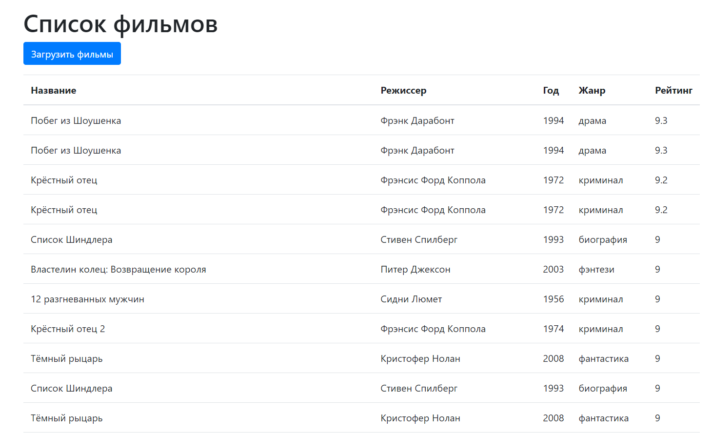
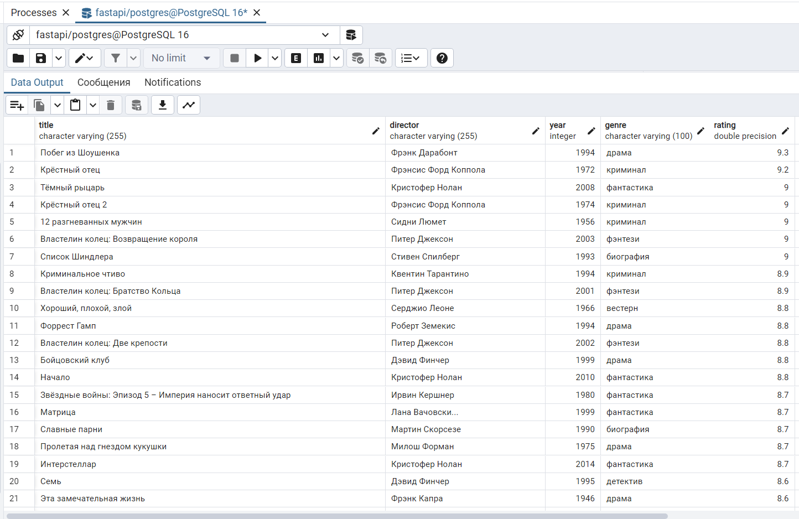

# Movie Collector

Movie Collector — это проект, разработанный с использованием FastAPI и SQLAlchemy для управления фильмами. Приложение
включает функционал для парсинга, сохранения данных о фильмах и отображения их на веб-странице.

## Используемые технологии

- **Python**: 3.11.5
- **FastApi**: 0.115.0
- **PostgresSql**: 16
- **pydantic**: 2.9.2
- **SQLAlchemy**: 2.0.35
- **asyncpg**: 0.29.0
- **alembic**: 1.13.3
- **Bootstrap**: версия 4.5.2 для стилизации интерфейсов
- **jquery**: 3.5.1

## Скриншоты

### Главная страница с заполненной таблицей



### Заполненная база данных



## Структура проекта

Проект включает следующие основные модель:

- **Movie**: для управления фильмами.

Для модели написаны миграции базы данных с помощью alembic.

## Установка

Чтобы запустить проект на локальной машине, следуйте инструкциям ниже:

1. Склонируйте репозиторий:

   ```bash
   git clone https://github.com/ElamanBaiguanishev/movie-collector-
   cd movie-collector-
2. Установите зависимости через pip:
    ```bash
    pip install -r requirements.txt
3. Настройте параметры подключения к базе данных в файле env.template. Выполните миграции и заполните базу данных
   начальными данными:
    ```bash
    alembic upgrade head
